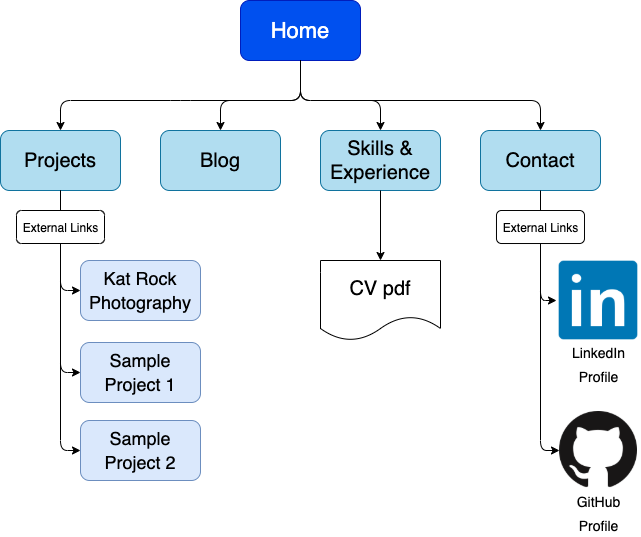
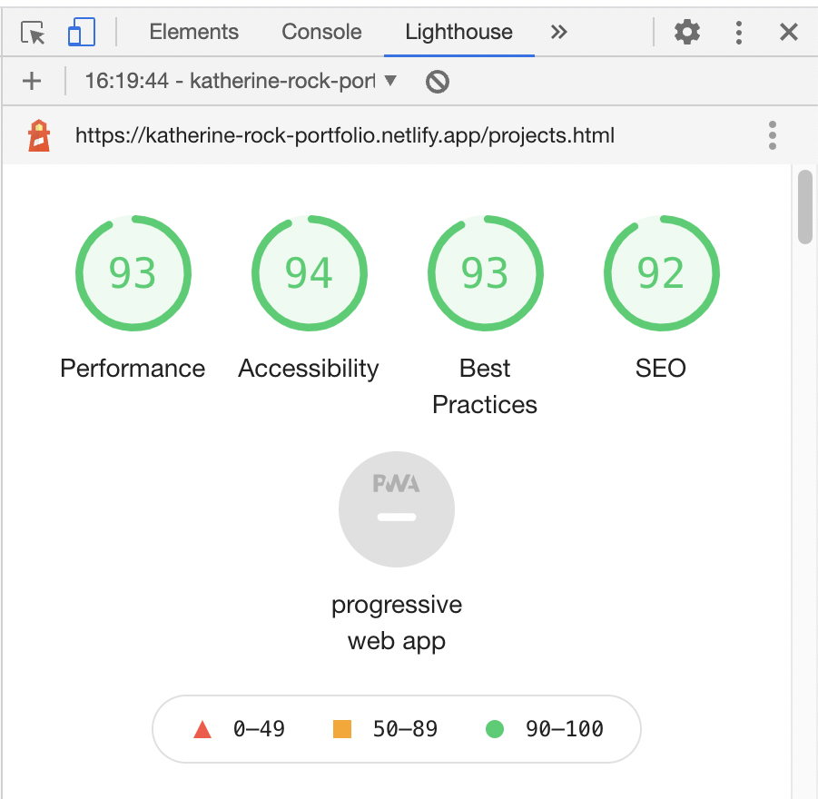
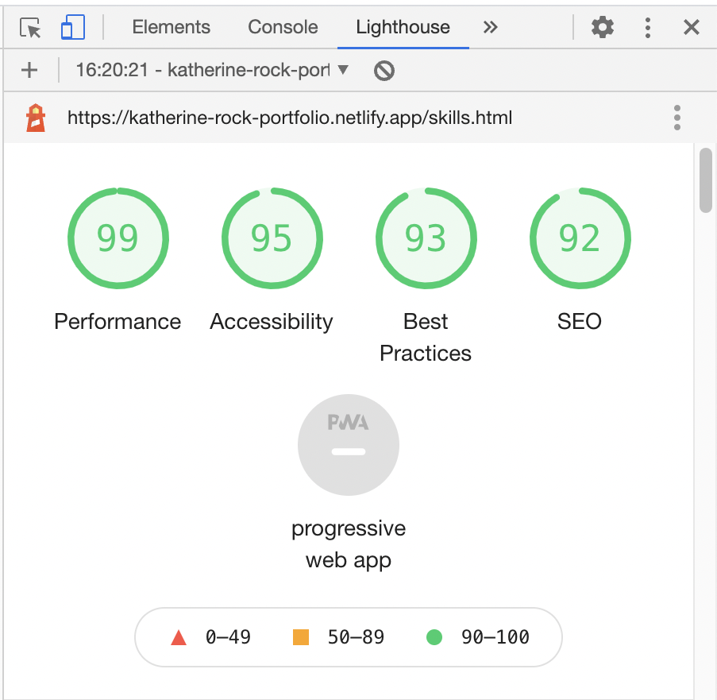
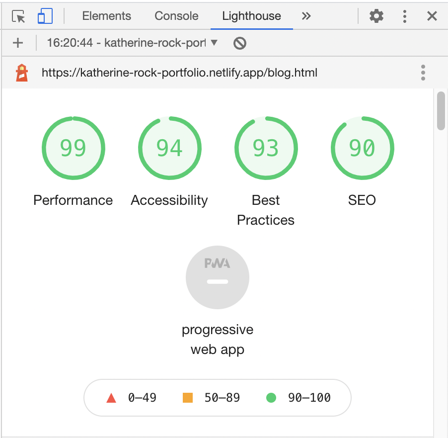
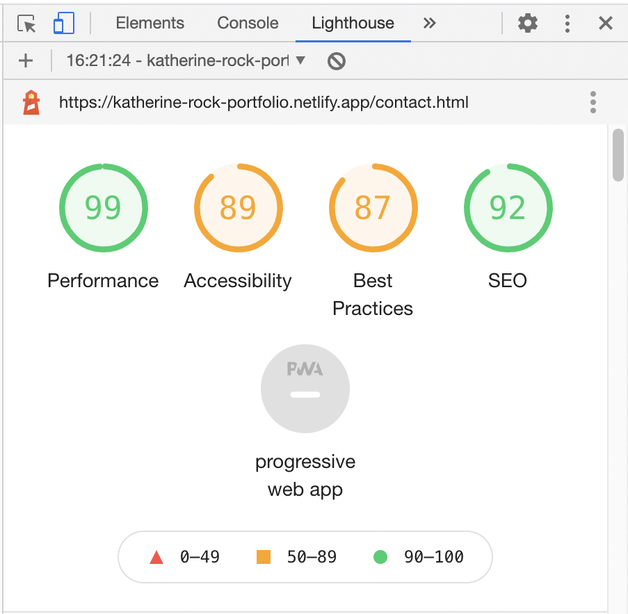
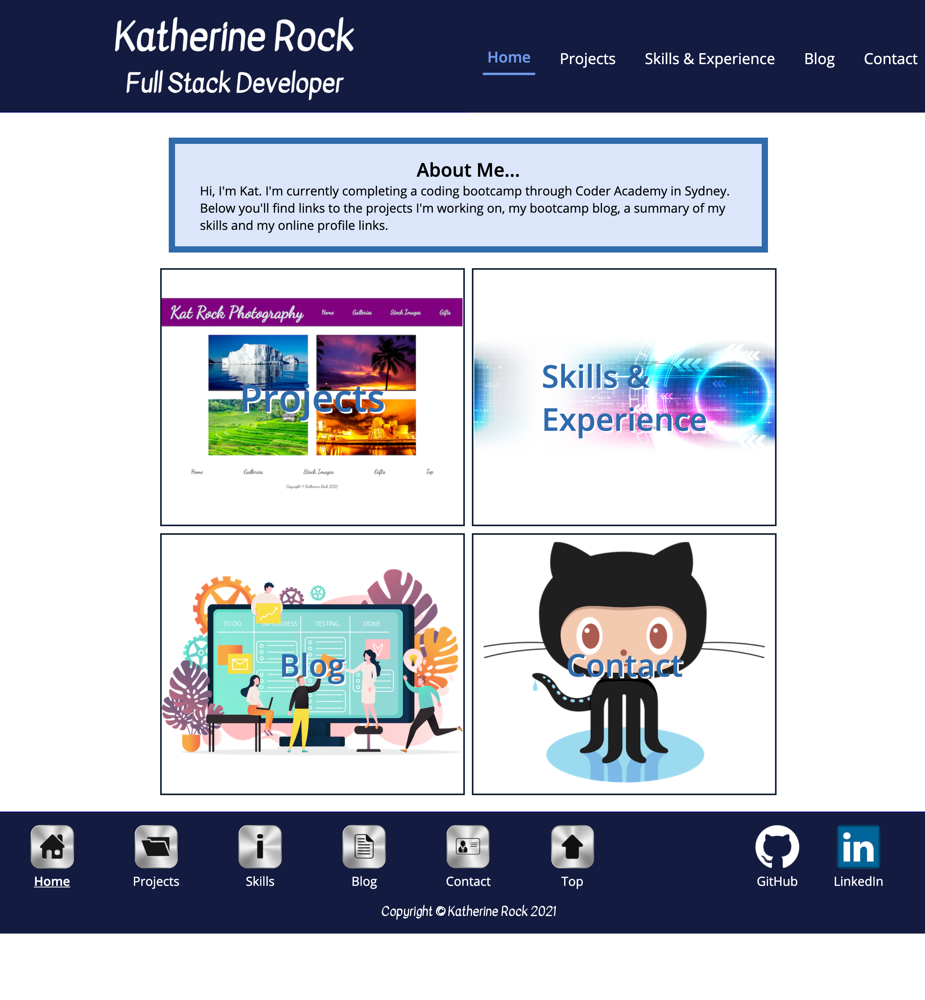
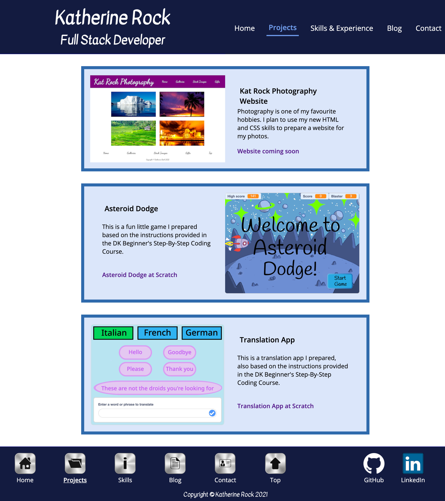
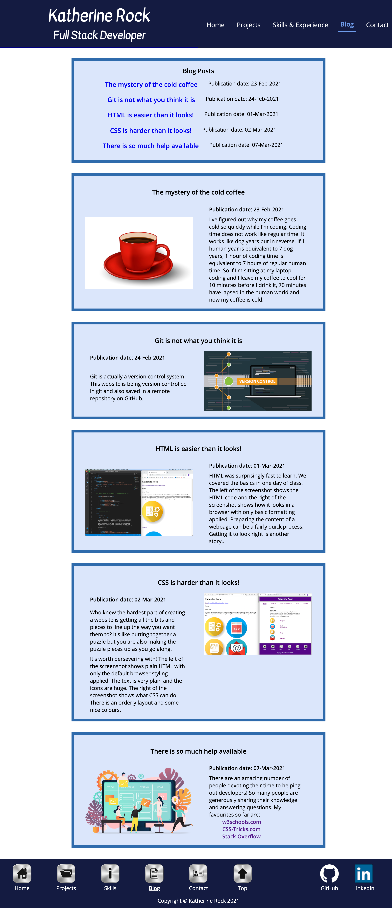
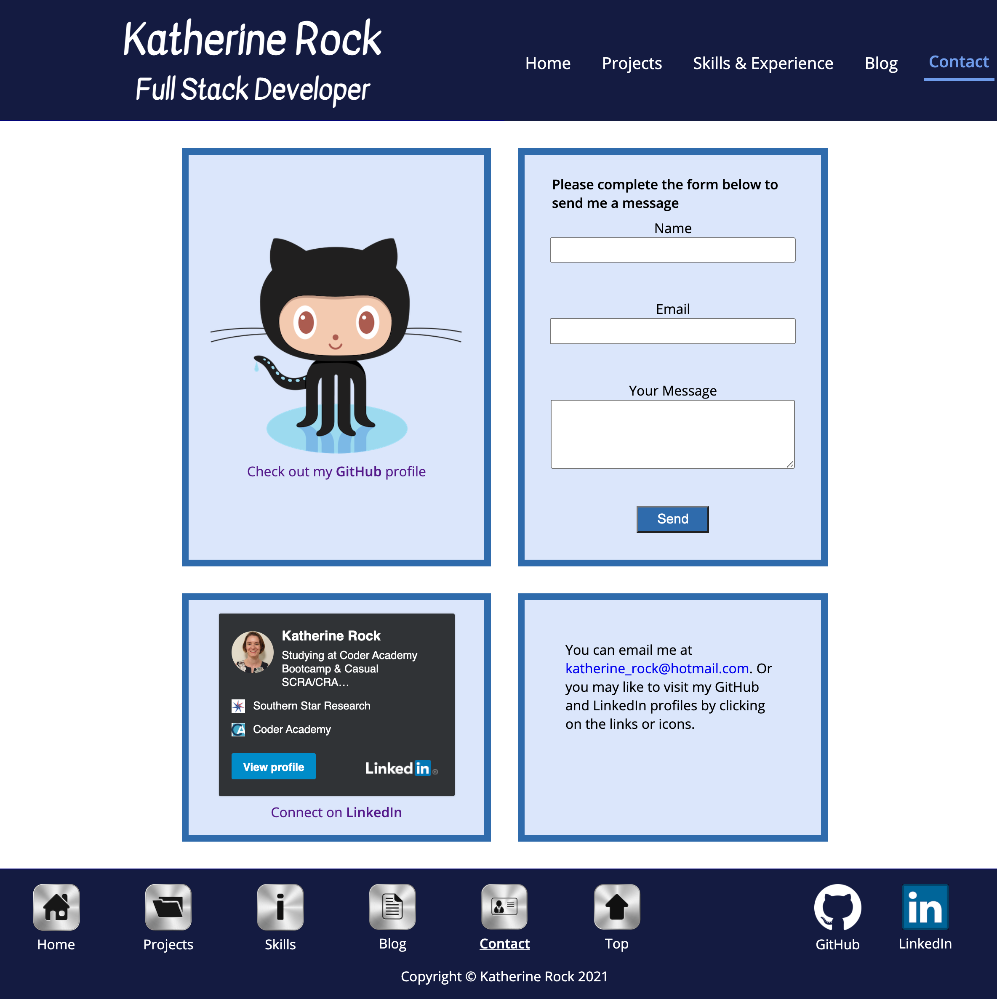
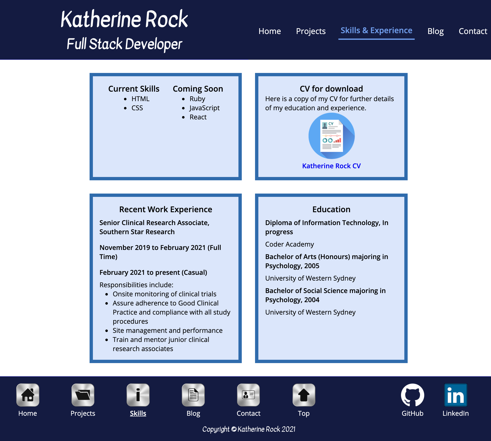

# Katherine Rock - Portfolio Website, Term 1 Assessment 2 #

## Link to published site: ##

https://katherine-rock-portfolio.netlify.app/index.html 

## Link to GitHub repository: ##

https://github.com/katherine-rock/T1A2_website_portfolio

## Purpose ##

The purpose of creating this website was to develop and practise HTML and CSS skills and to demonstrate these skills to potential employers. 

## Sitemap ##

## Functionality / Features ##

### Design ###
The design aim for the website was a simple, clean, uncluttered layout. The website features a balance of text, images and negative space in order not to be overwhelming.

The final mobile version of the home page differs from the original design. The initial design included small graphic icons for smaller screens to enable a fast load time but this was later changed to feature prominent images instead to maintain consistency with the layout of the other pages.

### Build ###
The website was designed and built for mobile first with media breakpoints added to tailor the content display across various screen sizes ranging from mobile to tablet to desktop. 

### Features ###
* Two navigation menus - one top navigation menu in the header and a second lower navigation menu in the footer.
* Consistent header and footer layout across all pages to assist navigation.
* Text links to complement icon links
* Colourful images to engage the audience and prevent text from becoming overwhelming.
* Dark text on light background to ensure ease of reading.

### Accessibility ###

Chrome's Lighthouse report function showed a high level of accessibility with an average rating of 93 out of 100 and ranging from 89 to 95 out of 100 across all pages.

## Screenshots ##
### Home page ###

### Projects ###

### Blog ###

### Contact ###

### Skills & Experience ###

## Target Audience ##
Potential employers and other developers. 

## Tech Stack ##
* HTML5
* CSS3
* Netlify (Hosting)
